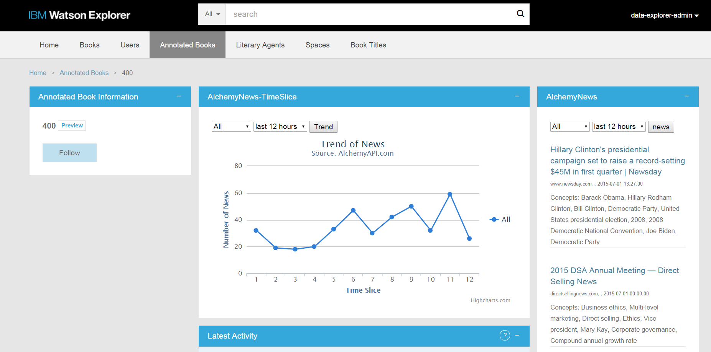

# Integrating the Watson Developer Cloud AlchemyAPI News Service with Watson Explorer

[IBM Watson Explorer](http://www.ibm.com/smarterplanet/us/en/ibmwatson/explorer.html) combines search and content analytics with unique cognitive computing capabilities available through external cloud services such as [Watson Developer Cloud](http://www.ibm.com/smarterplanet/us/en/ibmwatson/developercloud/) to help users find and understand the information they need to work more efficiently and make better, more confident decisions.

The [Watson AlchemyAPI](http://www.alchemyapi.com/) News API offers sophisticated search over a curated dataset of news and blogs that has been enriched with AlchemyAPI's text analysis. In this tutorial, we demonstrate development of two Watson Explorer Application Builder widgets that leverage the AlchemyAPI News API to produce a 360 degree app that allows end-users to keep their fingers on the pulse of their entities. There are additional cognitive functions available via the AlchemyAPI service in Bluemix that will be covered in other integration examples.  The full AlchemyAPI reference is available on the [AlchemyAPI website](http://www.alchemyapi.com/api).

The goal of this tutorial is to demonstrate how to get started with an integration between Watson Explorer and the Watson AlchemyAPI service available on IBM Watson Developer Cloud. By the end of the tutorial you will have enhanced the example-appbuilder app with a news widget that provides links to recent news articles and blog updates relevant to individual entities, as well as a trend widget that provides a visualization of the frequency with which individual entities appear in the news.



## Prerequisites
Please see the [Introduction](https://github.com/Watson-Explorer/wex-wdc-integration-samples) for an overview of the integration architecture, and the tools and libraries that need to be installed to create Java-based applications in Bluemix.

- An [IBM Bluemix](https://ace.ng.bluemix.net/) account
- [Watson Explorer](http://www.ibm.com/smarterplanet/us/en/ibmwatson/explorer.html) - Installed, configured, and running
- Completion of the Watson Explorer [AppBuilder tutorial](http://www.ibm.com/support/knowledgecenter/SS8NLW_10.0.0/com.ibm.swg.im.infosphere.dataexpl.appbuilder.doc/c_de-ab-devapp-tutorial.html)
- The [Application Builder proxy](https://github.com/Watson-Explorer/wex-wdc-integration-samples/tree/master/proxy) up and running.
- An API key from the [AlchemyAPI website](https://www.alchemyapi.com/api/register.html)


## What's Included in this Tutorial

This tutorial will walk through the creation and deployment of three components.

1. A basic Bluemix application exposing the Watson AlchemyAPI service as a web service.
2. A Watson Explorer Application Builder news article widget. This widget sends the name of the currently viewed entity to the Application Builder proxy, which in turn sends the entity name to the Bluemix application, which in turn sends the entity name to the AlchemyAPI service's News API, which responds with details of recent relevant articles.
3. A Watson Explorer Application Builder news trend widget.  This widget sends the name of the currently viewed entity to the proxy, Bluemix application, and News API as well, but instead of news articles, this widget requests *counts* of news articles, which are then plotted on a graph.

Modifications are also made to the Application Builder proxy to support this new chain of communication.


## Step-by-Step Tutorial

This section outlines the steps required to deploy a basic Watson AlchemyAPI News application in Bluemix and the custom widget in Application Builder.

### Creating the AlchemyAPI service and application in Bluemix

The Bluemix documentation can be found [here](https://www.ng.bluemix.net/docs/).

Navigate to the Bluemix dashboard and create a new application with Liberty for Java.

A new AlchemyAPI service must be created via the ACE Bluemix web UI.  The AlchemyAPI service cannot be created via the command line.  Navigate to the Bluemix dashboard and create a new AlchemyAPI service.  Notice that you are required to provide your AlchemyAPI key when the service is created.  Notice also that you must supply the name of the application you just created.  For the sake of the example, we have chosen to name the service `wex-AlchemyAPI`.  Notice that "user-provided" is the only available service plan for AlchemyAPI right now.

   
### Configuring and Deploying the Watson AlchemyAPI News Application in Bluemix

Clone this Git repository, or download the zip, extract, and navigate to the repository directory on the commandline.

The example Bluemix application uses a `manifest.yml` file to specify the application name, services bindings, and basic application settings.  Using a manifest simplifies distribution and deployment of CloudFoundry applications.

* Modify the manifest.yml file to agree with the service name, application name, and host name of the service and application you created in the previous step.

To deploy the Watson AlchemyAPI News example application you'll need to compile the application and deploy it to Bluemix.

If you have not done so already, sign in to Bluemix.

```
$> cf api api.ng.bluemix.net
...
$> cf login
```

Build the application web service using [Apache Maven](http://maven.apache.org/). Before performing this step, verify that you are in the `/bluemix` directory of this repository. This will generate a Java WAR called `wex-wdc-AlchemyNews-sample.war`.

```
$> mvn install
```


Finally, deploy the application to your space in the Bluemix cloud.  Subsequent pushes to Bluemix will overwrite the previous instances you have deployed.

```
$> cf push
```


Once the application has finished restarting, you should now be able to run a test using the simple application test runner included in the WAR.  You can view the route that was created for your application with `cf routes`.  The running application URL can be determined by combining the host and domain from the routes listing.  You can also find this information in the `manifest.yml` file.

### Modifications to the Application Builder proxy

A [proxy](https://github.com/Watson-Explorer/wex-wdc-integration-samples/tree/master/proxy) was developed to run on the Application Builder server to satisfy the same-origin policy of end-user web browsers when individual widgets need to contact other hosts (for example, in Bluemix) via AJAX.  Watson Explorer version 11 introduces the concept of "endpoints" that can address this security restriction without the use of a proxy.  Administrators of earlier versions of Watson Explorer need to follow these steps to modify the proxy developed for integrations like this.

Two changes to the proxy are necessary:

1. * Navigate to the proxy installation directory.  This is typically under the Watson Explorer installation directory at `AppBuilder/wlp/usr/servers/AppBuilder/apps/proxy`.
   * Enter the `WEB-INF` directory.
   * Edit the `config.ru` file.
   * Add the following line near the other similar lines, replacing `YOUR_ALCHEMYAPI_HOST` with the host you chose above in your manifest.yml.   
     `set :an_endpoint, "http://YOUR_ALCHEMYAPI_HOST.mybluemix.net/api/getnews"`
2. * Enter the `lib` directory
   * Edit the `proxy.rb` file
   * Add the following code block
   ```
   post '/an/' do
      data = JSON.load(request.body)
      body = { :start => data["start"],
                           :end => data["end"],
                           :maxResults => data["maxResults"],
                           :timeSlice => data["timeSlice"],
                           :qEntity => data["qEntity"],
                           :qSentiment => data["qSentiment"],
                           :returns => data["returns"]
                           }
      body = URI.encode_www_form(body)
      headers = {
         "Content-Type" => "application/x-www-form-urlencoded"
      }
      response = Excon.post(settings.an_endpoint, :body => body, :headers => headers)

      response.body
   end
   ```

### Watson Explorer Application Builder widget for AlchemyAPI News in Bluemix

Assuming you have completed the first [Application Builder tutorial](http://www.ibm.com/support/knowledgecenter/SS8NLW_10.0.0/com.ibm.swg.im.infosphere.dataexpl.appbuilder.doc/c_de-ab-devapp-tutorial.html), you will have some book entities.  Let's add a AlchemyAPI News widget that will provide links to the latest news about any book.  After that, we add a AlchemyAPI News trend widget to see what the trend of mentions in the news looks like.

#### Building and configuring a widget that sends queries to the Watson AlchemyAPI News API

The purpose of this example widget is to send the entity name to the Watson AlchemyAPI News API.  The results of the AlchemyAPI News search are displayed in the Application Builder UI.  Controls are provided to modify the news search.

Once you have logged into the Application Builder administrative interface, follow these steps to create the custom widget and add it to the Book Title entity.

1. Navigate to the Pages & Widgets -> Book Title -> detail page.
2. Create a new Custom widget.
3. Set the ID of the widget to be `WDC_AlchemyAPI_News`
4. Set the Display name of the widget to be `AlchemyAPI News`
5. Copy and paste the [code for this widget](appbuilder/AlchemyNews-widget.erb) into the Type-specific Configuration.
6. Save the widget.
7. Go back to the Book Title > detail page.
8. Drag the `WDC_AlchemyAPI_News` widget to the top of the right column and save the page configuration.


**NOTE:** At this point the widget should be fully configured.  **However, you may find far more relevant news results** for your data if you specify the entity type as part of the news query.  There exist other AlchemyAPI News API parameters that you may find useful for tuning your results.  See the AlchemyAPI documentation for [details about using entity types](http://docs.alchemyapi.com/v1.0/docs/entities) as well as [nearly 400 other parameters](http://docs.alchemyapi.com/v1.0/docs/full-list-of-supported-news-api-fields) that can be used to construct sophisticated News API queries.

In addition to building the right query, ensure that you are requesting the appropriate data for the response.  There are many example queries in the AlchemyAPI News API documentation.

#### Building and configuring a widget that uses the Watson AlchemyAPI News API to display a news trend graph

The purpose of this example widget is to display a graph of the number of news results.  This news visualization allows your end-users to quickly see whether an entity is trending in the news.

Follow the steps outlined for the news widget above, but this time for the [trend widget](appbuilder/AlchemyNews-trend-widget.erb), with an appropriately different ID and display name.  Consider creating a flip widget that cycles between the news search results and the news trend graph.


# Implementation Considerations

- **Privacy and Security** - The AlchemyAPI News widget makes a web request to the Bluemix application endpoint configured in the Application Builder proxy.  In this example, this call is made over an unencrypted and unauthenticated HTTP connection, but your Bluemix application can be modified to support better security.
- **Failures will happen** - All distributed systems are inherently unreliable and failures will inevitably occur when attempting to call out to Bluemix.  Consider how failures should be handled.
- **Data Preparation** - It is the responsibility of the caller to ensure that representative data is being sent to the AlchemyAPI News API.  Additional data preparation may be required in some cases.  Choose content carefully and be sure you are sending a clean news query.
- **Scalability** - This example uses only a single cloud instance with the default Bluemix application settings.  In a production scenario consider how much hardware will be required and adjust the Bluemix application settings accordingly.

## Caching Proxy
Given the considerations listed here, the use of a caching proxy is always recommended in a Production environment.  Using a caching proxy can speed up widget refreshes in some situations, overcome some network failures, and in some cases may also allow you to reduce the total number of required AlchemyAPI transactions.


# Licensing
All sample code contained within this project repository or any subdirectories is licensed according to the terms of the MIT license, which can be viewed in the file license.txt.


# Open Source @ IBM
[Find more open source projects on the IBM Github Page](http://ibm.github.io/)

    
